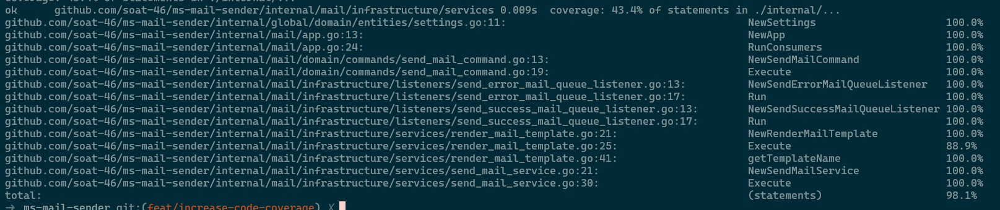

# ms-mail-sender

This project is a microservice that sends emails.
The application receives the emails from a queue and sends them to an SMTP server.

### 🧪 Testing

To run the tests, run the following command:

```bash
make test
```



### Project Environment Variables

These environment variables are required to run the application:

| Name          | Description          |
|---------------|----------------------|
| MAIL_HOST     | SMTP server host     |
| MAIL_PORT     | SMTP server port     |
| MAIL_USERNAME | SMTP server username |
| MAIL_PASSWORD | SMTP server password |
| MAIL_FROM     | Sender email address |
